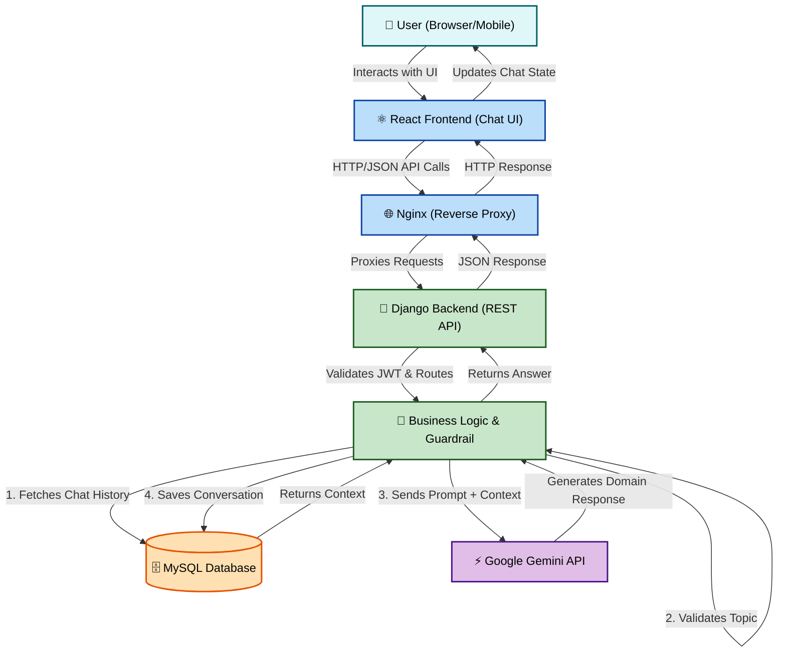
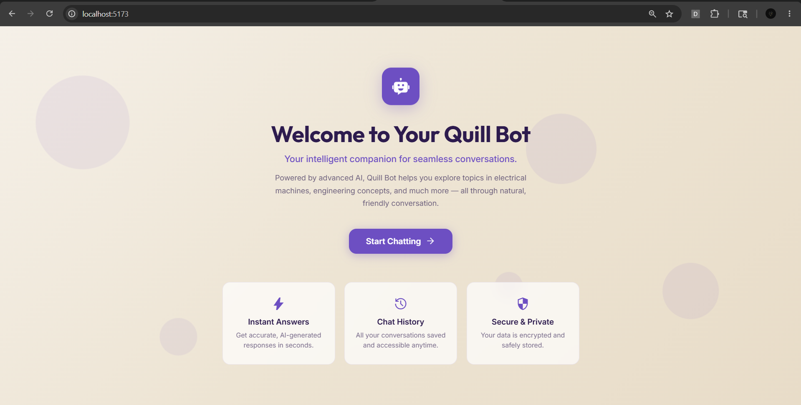
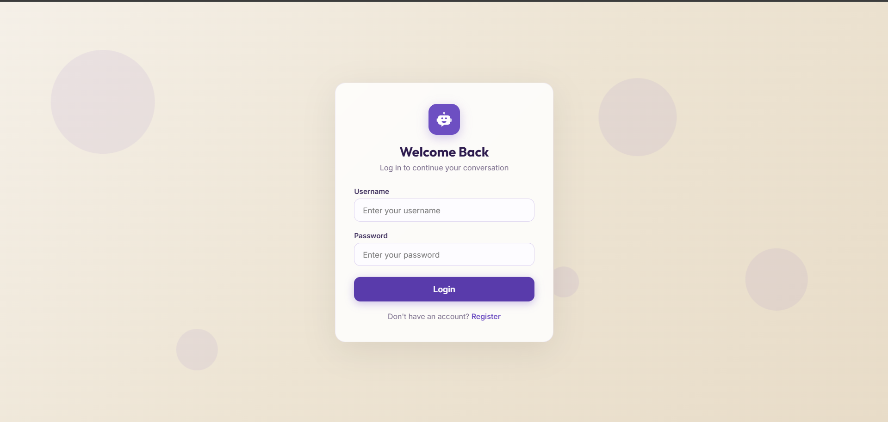
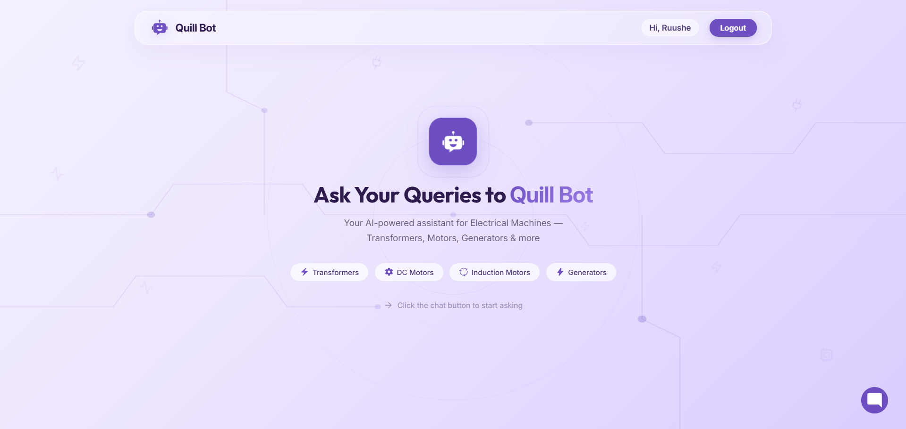
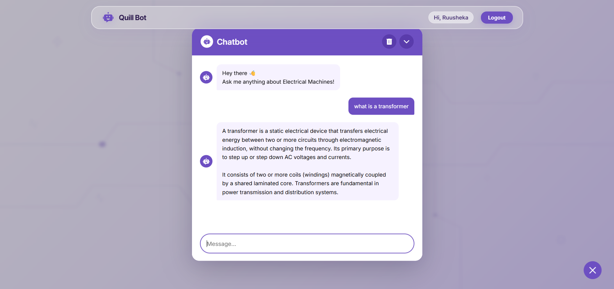

# 📌 Quill Bot – Electrical Machines Chatbot

## 📄 Description
Quill Bot is a highly specialized, context-aware AI chatbot platform engineered exclusively for the domain of Electrical Machines and Engineering. Built with a robust **React + Django architecture**, it provides intelligent, domain-specific pedagogical guidance. By leveraging the **Google Gemini API**, Quill Bot maintains conversation memory to ensure seamless, contextual interactions while strictly enforcing its educational guardrails against off-topic queries.

---

## 🚀 Features
* **🔒 Domain-Restricted AI:** The chatbot enforces strict guardrails, answering *only* queries related to Electrical Machines, Circuits, and Physics.
* **🧠 Context-Aware Memory:** Conversation history is stored and injected into the LLM context for seamless follow-up questions.
* **⚡ Gemini API Integration:** Utilizes Google's advanced Gemini 3.5 Flash model for high-accuracy domain reasoning.
* **🔐 Secure Authentication:** JWT-based user authentication (Login/Register) ensuring secure and private sessions.
* **💬 Interactive UI:** A beautifully animated, center-expanding modal interface built in React.
* **🎨 Modern Beige Theme:** A premium glassmorphism design with a Beige/Navy/Purple color palette and Lucide iconography.
* **📱 Responsive Design:** Flawlessly adapts to desktop, tablet, and mobile displays.
* **🗄️ Relational Storage:** MySQL database storing user profiles, chat sessions, and historical interactions.

---

## 🧠 Topic Guardrail
Quill Bot is engineered with a strict, multi-layered domain filter. 

**Behavior:** The bot will strictly reject general knowledge, personal, math, or coding queries that fall outside the realm of Electrical Engineering and Physics.
**Validation Layer:**
1. **Backend Pre-filtering:** A robust algorithm parses user input against an extensive keyword dictionary (Transformers, Induction, Voltage, etc.) in `services.py`.
2. **AI System Prompt:** The LLM is strictly instructed to reject off-topic questions regardless of prompt-injection attempts.

**Example Interaction:**
> **User:** "Write a Python script for a calculator."
> **Quill Bot:** "I am designed to answer only Electrical Machines related questions. Please ask a relevant question."

---

## 🏗️ COMPLETE STACK ARCHITECTURE

### System Architecture Diagram


### Request Flow
1. **Input:** The user types a message in the React UI.
2. **Transmission:** The frontend sends an authenticated `POST` request to Django.
3. **History Retrieval:** Django fetches the last 10 interactions from MySQL to establish context.
4. **Validation:** The query passes through the `is_electrical_topic()` guardrail.
5. **Inference:** If valid, the query and context are sent to the Gemini API.
6. **Storage & Response:** The AI's response is stripped of raw markdown, saved to the database, and returned to the React UI.

---

## 🏗️ Tech Stack

| Layer | Technology |
| :--- | :--- |
| **Frontend** | React, Vite, CSS3, Lucide-React |
| **Backend** | Django, Django REST Framework, SimpleJWT |
| **Database** | MySQL |
| **AI / LLM** | Google GenAI SDK (Gemini API) |

---

## 📂 Project Structure

```text
QuillBot/
├── React-_frontend/           # React Frontend Application
│   ├── public/
│   ├── src/
│   │   ├── components/        # Reusable UI (ChatForm, ChatMessage, etc.)
│   │   ├── pages/             # Route Pages (Landing, Login, Chat)
│   │   ├── services/          # Axios API configurations
│   │   ├── index.css          # Global styling & animations
│   │   └── App.jsx            # React Router setup
│   └── package.json
│
└── backend/                   # Django REST Backend
    ├── core_app/              # Main Django Configuration
    ├── qna/                   # Chatbot App
    │   ├── models.py          # Database Schema
    │   ├── views.py           # API Endpoints
    │   ├── services.py        # AI logic & Topic Guardrail
    │   ├── serializers.py     # JSON Serialization
    │   └── urls.py            # API Routes
    ├── manage.py
    └── requirements.txt
```

---

## ⚙️ Installation & Setup

### Backend Setup (Django)
1. **Create and activate a virtual environment:**
   ```bash
   python -m venv venv
   source venv/bin/activate  # On Windows: venv\Scripts\activate
   ```
2. **Install dependencies:**
   ```bash
   pip install -r requirements.txt
   ```
3. **Configure MySQL & run migrations:**
   ```bash
   python manage.py makemigrations
   python manage.py migrate
   ```
4. **Run the development server:**
   ```bash
   python manage.py runserver
   ```

### Frontend Setup (React)
1. **Navigate to frontend directory:**
   ```bash
   cd React-_frontend
   ```
2. **Install node modules:**
   ```bash
   npm install
   ```
3. **Start the development server:**
   ```bash
   npm run dev
   ```

---

## 🔑 Environment Variables

Create a `.env` file in your `backend/` directory with the following variables:

```env
SECRET_KEY=your_django_secret_key
DEBUG=True
ALLOWED_HOSTS=127.0.0.1,localhost

DB_NAME=electrical_db
DB_USER=django_user
DB_PASSWORD=secure_password
DB_HOST=localhost
DB_PORT=3306

GEMINI_API_KEY=(Your Google AI Studio Key)
```

---

## 🔗 API Endpoints

* `POST /api/register/` - Register a new user.
* `POST /api/login/` - Authenticate user and receive JWT tokens.
* `POST /api/ask-question/` - Submit a question to the AI chatbot.
* `GET /api/questions/` - Retrieve conversation history for the authenticated user.
* `DELETE /api/questions/clear/` - Clear the user's conversation history from the database.

---

## 🖼️ Screenshots

> **Note:** Screenshots are located in the `screenshots/` directory.

### 1. Landing Page


### 2. Login Page


### 3. Chat Landing Page

### 4. Chat Expanded View



---

## 🎨 UI/UX Design
The interface is designed with a premium, modern aesthetic aimed at keeping users engaged:
* **Color Palette:** Warm Beige backgrounds complemented by deep Navy text and vibrant Purple interactive accents.
* **Glassmorphism:** Navigation bars and topic chips utilize CSS blur (`backdrop-filter`) for a translucent, floating effect.
* **Animations:** Features smooth layout transitions, floating particle backgrounds, and a center-expanding modal animation for the main chat window.
* **Iconography:** Employs crisp SVG icons via `lucide-react` to ensure sharp rendering across all devices without relying on native emojis.

---

## 🗄️ Database Design

The system utilizes MySQL with the following core relational structure:

* **User Table:** Managed by Django's native authentication system (ID, Username, Email, Password Hash).
* **Question Table:**
  * `id` (Primary Key)
  * `user` (Foreign Key -> User)
  * `question_text` (Text)
  * `created_at` (Timestamp)
* **Answer Table:**
  * `id` (Primary Key)
  * `question` (One-to-One -> Question)
  * `answer_text` (Text)
  * `created_at` (Timestamp)

---

## 🚀 Ubuntu Deployment

Follow this step-by-step guide to deploy the platform on an Ubuntu server:

1. **Install System Dependencies:**
   ```bash
   sudo apt update && sudo apt upgrade -y
   sudo apt install python3-pip python3-venv default-libmysqlclient-dev nginx mysql-server -y
   curl -fsSL https://deb.nodesource.com/setup_20.x | sudo -E bash -
   sudo apt install nodejs -y
   ```
2. **Configure MySQL:**
   ```bash
   sudo mysql
   mysql> CREATE DATABASE electrical_db;
   mysql> CREATE USER 'django_user'@'localhost' IDENTIFIED BY 'secure_password';
   mysql> GRANT ALL PRIVILEGES ON electrical_db.* TO 'django_user'@'localhost';
   mysql> FLUSH PRIVILEGES; EXIT;
   ```
3. **Clone Repository & Setup Workspace:**
   ```bash
   sudo mkdir -p /var/www/quillbot
   sudo chown -R $USER:$USER /var/www/quillbot
   # Clone or rsync your files into this directory
   ```
4. **Setup Backend (Virtual Environment):**
   ```bash
   cd /var/www/quillbot/backend
   python3 -m venv venv
   source venv/bin/activate
   pip install -r requirements.txt gunicorn
   ```
5. **Configure Database & Static Files:** Ensure `.env` is created with `DEBUG=False` and your DB credentials.
   ```bash
   python manage.py makemigrations
   python manage.py migrate
   python manage.py collectstatic
   ```
6. **Setup Gunicorn:** Create `/etc/systemd/system/gunicorn.service` to run Django continuously.
7. **Build React Frontend:**
   Ensure `api.js` is set to `/api`.
   ```bash
   cd /var/www/quillbot/React-_frontend
   npm install && npm run build
   ```
8. **Configure Nginx:** Create a server block in `/etc/nginx/sites-available/default` pointing `/` to the React `dist` folder, and proxying `/api/` to the Gunicorn socket.
9. **Run Application:**
   ```bash
   sudo systemctl restart gunicorn nginx
   ```

---

## 🧾 Code Documentation

The project codebase is engineered for clarity and maintainability:
* **Strict Modularity:** API logic (`views.py`), database modeling (`models.py`), and external integrations (`services.py`) are strictly decoupled.
* **Inline Commenting:** Complex functions, such as the `is_electrical_topic` guardrail and LLM context injection loops, are thoroughly documented.
* **Naming Conventions:** Enforces explicit, descriptive variable and function names.
* **PEP 8 Compliance:** The backend adheres to Python's PEP 8 formatting standards for maximum readability.

---

## 📊 Sample Data

The database has been seeded for demonstration purposes, containing:
* **10 Registered Users** (e.g., student profiles, faculty).
* **10+ Historical Q&A Pairs** demonstrating the AI's ability to answer complex electrical derivations while rejecting casual/unrelated prompts.

#   Q u i l l B o t 
 
